# Visual Anomaly Detection System - Architecture Diagrams

## System Overview Diagram

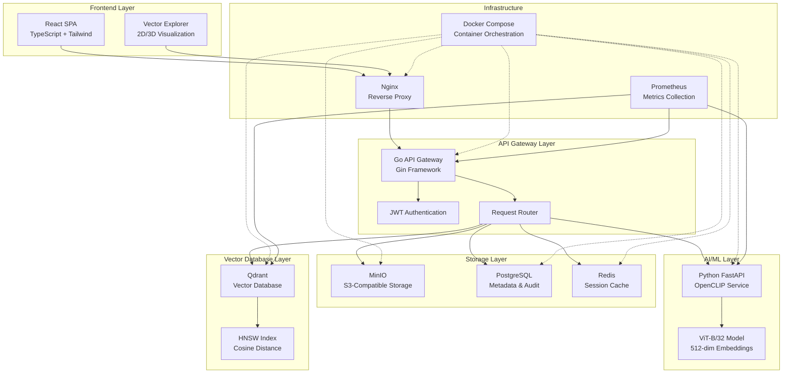
```mermaid
graph TB
    subgraph "Frontend Layer"
        UI[React SPA<br/>TypeScript + Tailwind]
        VE[Vector Explorer<br/>2D/3D Visualization]
    end
    
    subgraph "API Gateway Layer"
        API[Go API Gateway<br/>Gin Framework]
        AUTH[JWT Authentication]
        ROUTER[Request Router]
    end
    
    subgraph "Storage Layer"
        MINIO[MinIO<br/>S3-Compatible Storage]
        PG[PostgreSQL<br/>Metadata & Audit]
        REDIS[Redis<br/>Session Cache]
    end
    
    subgraph "AI/ML Layer"
        EMBED[Python FastAPI<br/>OpenCLIP Service]
        MODEL[ViT-B/32 Model<br/>512-dim Embeddings]
    end
    
    subgraph "Vector Database Layer"
        QDRANT[Qdrant<br/>Vector Database]
        HNSW[HNSW Index<br/>Cosine Distance]
    end
    
    subgraph "Infrastructure"
        NGINX[Nginx<br/>Reverse Proxy]
        DOCKER[Docker Compose<br/>Container Orchestration]
        PROM[Prometheus<br/>Metrics Collection]
    end
    
    UI --> NGINX
    VE --> NGINX
    NGINX --> API
    API --> AUTH
    API --> ROUTER
    ROUTER --> EMBED
    ROUTER --> QDRANT
    ROUTER --> MINIO
    ROUTER --> PG
    ROUTER --> REDIS
    EMBED --> MODEL
    QDRANT --> HNSW
    
    DOCKER -.-> NGINX
    DOCKER -.-> API
    DOCKER -.-> EMBED
    DOCKER -.-> QDRANT
    DOCKER -.-> MINIO
    DOCKER -.-> PG
    DOCKER -.-> REDIS
    
    PROM --> API
    PROM --> EMBED
    PROM --> QDRANT
```

## Data Flow Diagrams

### 1. Image Upload Flow

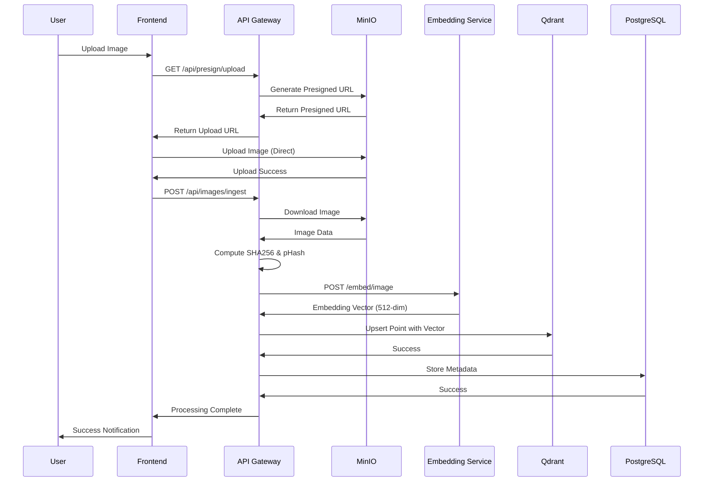
```mermaid
sequenceDiagram
    participant U as User
    participant F as Frontend
    participant A as API Gateway
    participant M as MinIO
    participant E as Embedding Service
    participant Q as Qdrant
    participant P as PostgreSQL

    U->>F: Upload Image
    F->>A: GET /api/presign/upload
    A->>M: Generate Presigned URL
    M->>A: Return Presigned URL
    A->>F: Return Upload URL
    F->>M: Upload Image (Direct)
    M->>F: Upload Success
    F->>A: POST /api/images/ingest
    A->>M: Download Image
    M->>A: Image Data
    A->>A: Compute SHA256 & pHash
    A->>E: POST /embed/image
    E->>A: Embedding Vector (512-dim)
    A->>Q: Upsert Point with Vector
    Q->>A: Success
    A->>P: Store Metadata
    P->>A: Success
    A->>F: Processing Complete
    F->>U: Success Notification
```

### 2. Similarity Search Flow

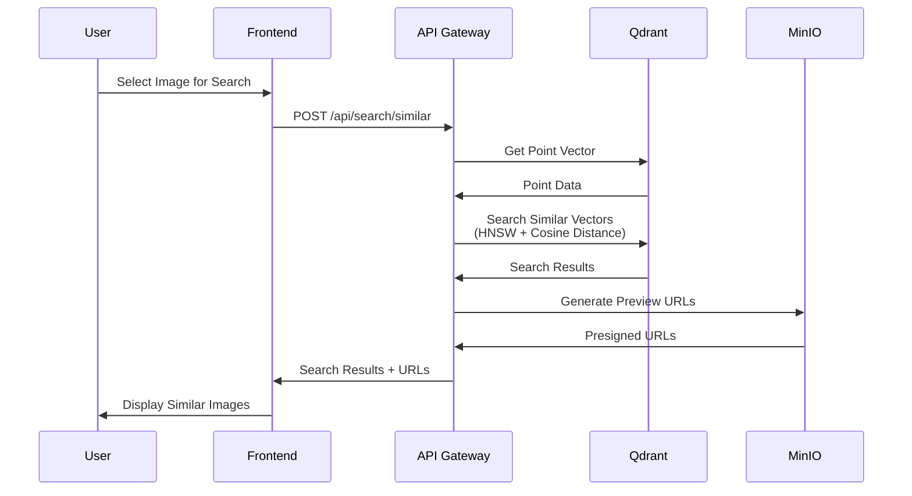
```mermaid
sequenceDiagram
    participant U as User
    participant F as Frontend
    participant A as API Gateway
    participant Q as Qdrant
    participant M as MinIO

    U->>F: Select Image for Search
    F->>A: POST /api/search/similar
    A->>Q: Get Point Vector
    Q->>A: Point Data
    A->>Q: Search Similar Vectors<br/>(HNSW + Cosine Distance)
    Q->>A: Search Results
    A->>M: Generate Preview URLs
    M->>A: Presigned URLs
    A->>F: Search Results + URLs
    F->>U: Display Similar Images
```

### 3. Deduplication Flow

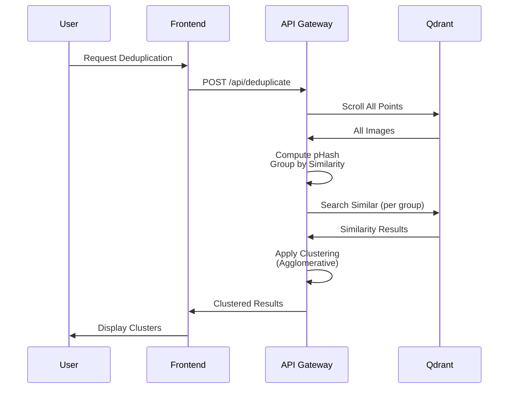
```mermaid
sequenceDiagram
    participant U as User
    participant F as Frontend
    participant A as API Gateway
    participant Q as Qdrant

    U->>F: Request Deduplication
    F->>A: POST /api/deduplicate
    A->>Q: Scroll All Points
    Q->>A: All Images
    A->>A: Compute pHash<br/>Group by Similarity
    A->>Q: Search Similar (per group)
    Q->>A: Similarity Results
    A->>A: Apply Clustering<br/>(Agglomerative)
    A->>F: Clustered Results
    F->>U: Display Clusters
```

### 4. Anomaly Detection Flow

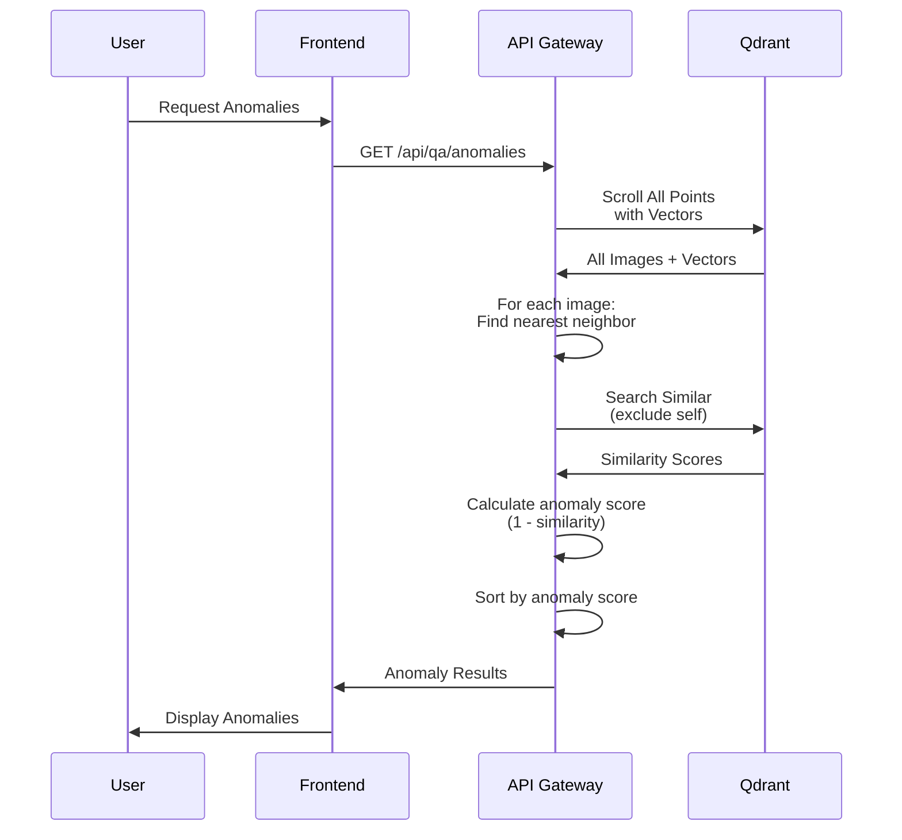
```mermaid
sequenceDiagram
    participant U as User
    participant F as Frontend
    participant A as API Gateway
    participant Q as Qdrant

    U->>F: Request Anomalies
    F->>A: GET /api/qa/anomalies
    A->>Q: Scroll All Points<br/>with Vectors
    Q->>A: All Images + Vectors
    A->>A: For each image:<br/>Find nearest neighbor
    A->>Q: Search Similar<br/>(exclude self)
    Q->>A: Similarity Scores
    A->>A: Calculate anomaly score<br/>(1 - similarity)
    A->>A: Sort by anomaly score
    A->>F: Anomaly Results
    F->>U: Display Anomalies
```

## Component Architecture

### Frontend Component Structure

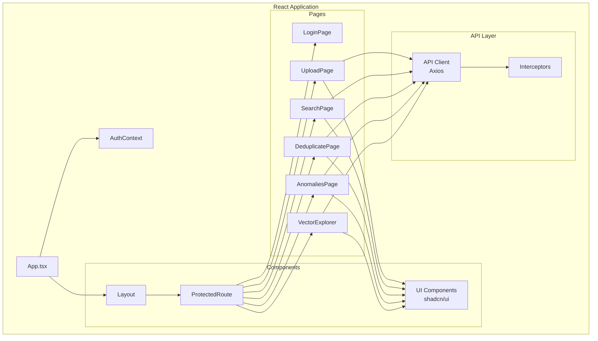
```mermaid
graph TD
    subgraph "React Application"
        APP[App.tsx]
        AUTH[AuthContext]
        
        subgraph "Pages"
            LOGIN[LoginPage]
            UPLOAD[UploadPage]
            SEARCH[SearchPage]
            DEDUP[DeduplicatePage]
            ANOM[AnomaliesPage]
            VECTOR[VectorExplorer]
        end
        
        subgraph "Components"
            UI[UI Components<br/>shadcn/ui]
            LAYOUT[Layout]
            PROTECT[ProtectedRoute]
        end
        
        subgraph "API Layer"
            CLIENT[API Client<br/>Axios]
            INTERCEPT[Interceptors]
        end
    end
    
    APP --> AUTH
    APP --> LAYOUT
    LAYOUT --> PROTECT
    PROTECT --> LOGIN
    PROTECT --> UPLOAD
    PROTECT --> SEARCH
    PROTECT --> DEDUP
    PROTECT --> ANOM
    PROTECT --> VECTOR
    
    UPLOAD --> UI
    SEARCH --> UI
    DEDUP --> UI
    ANOM --> UI
    VECTOR --> UI
    
    UPLOAD --> CLIENT
    SEARCH --> CLIENT
    DEDUP --> CLIENT
    ANOM --> CLIENT
    VECTOR --> CLIENT
    
    CLIENT --> INTERCEPT
```

### Backend Service Architecture

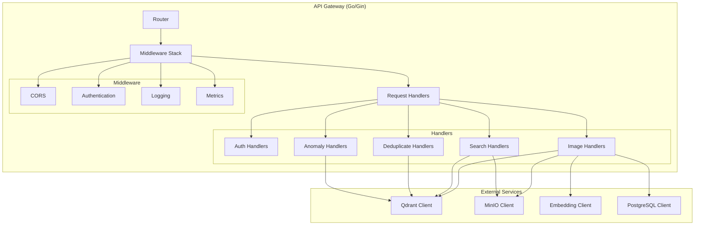
```mermaid
graph TD
    subgraph "API Gateway (Go/Gin)"
        ROUTER[Router]
        MIDDLEWARE[Middleware Stack]
        HANDLERS[Request Handlers]
        
        subgraph "Middleware"
            CORS[CORS]
            AUTH[Authentication]
            LOGGING[Logging]
            METRICS[Metrics]
        end
        
        subgraph "Handlers"
            AUTH_H[Auth Handlers]
            IMAGE_H[Image Handlers]
            SEARCH_H[Search Handlers]
            DEDUP_H[Deduplicate Handlers]
            ANOM_H[Anomaly Handlers]
        end
    end
    
    subgraph "External Services"
        QDRANT[Qdrant Client]
        MINIO[MinIO Client]
        EMBED[Embedding Client]
        DB[PostgreSQL Client]
    end
    
    ROUTER --> MIDDLEWARE
    MIDDLEWARE --> CORS
    MIDDLEWARE --> AUTH
    MIDDLEWARE --> LOGGING
    MIDDLEWARE --> METRICS
    MIDDLEWARE --> HANDLERS
    
    HANDLERS --> AUTH_H
    HANDLERS --> IMAGE_H
    HANDLERS --> SEARCH_H
    HANDLERS --> DEDUP_H
    HANDLERS --> ANOM_H
    
    IMAGE_H --> MINIO
    IMAGE_H --> EMBED
    IMAGE_H --> QDRANT
    IMAGE_H --> DB
    
    SEARCH_H --> QDRANT
    SEARCH_H --> MINIO
    
    DEDUP_H --> QDRANT
    ANOM_H --> QDRANT
```

## Database Schema

### PostgreSQL Schema

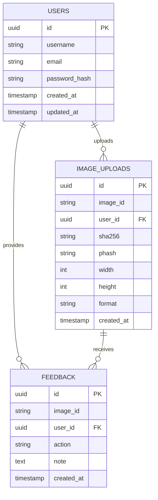
```mermaid
erDiagram
    USERS {
        uuid id PK
        string username
        string email
        string password_hash
        timestamp created_at
        timestamp updated_at
    }
    
    IMAGE_UPLOADS {
        uuid id PK
        string image_id
        uuid user_id FK
        string sha256
        string phash
        int width
        int height
        string format
        timestamp created_at
    }
    
    FEEDBACK {
        uuid id PK
        string image_id
        uuid user_id FK
        string action
        text note
        timestamp created_at
    }
    
    USERS ||--o{ IMAGE_UPLOADS : "uploads"
    USERS ||--o{ FEEDBACK : "provides"
    IMAGE_UPLOADS ||--o{ FEEDBACK : "receives"
```

### Qdrant Collection Schema

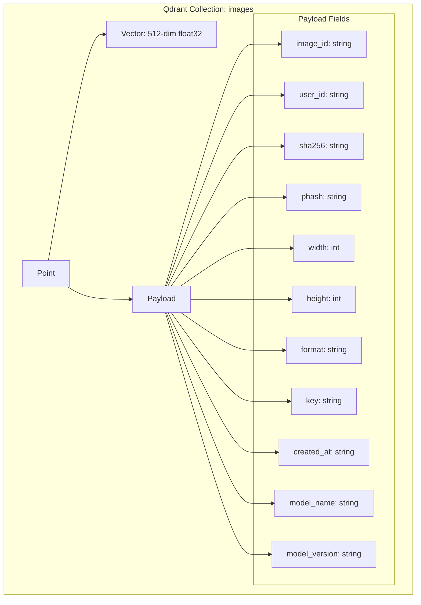
```mermaid
graph TD
    subgraph "Qdrant Collection: images"
        POINT[Point]
        VECTOR[Vector: 512-dim float32]
        PAYLOAD[Payload]
        
        subgraph "Payload Fields"
            IMAGE_ID[image_id: string]
            USER_ID[user_id: string]
            SHA256[sha256: string]
            PHASH[phash: string]
            WIDTH[width: int]
            HEIGHT[height: int]
            FORMAT[format: string]
            KEY[key: string]
            CREATED_AT[created_at: string]
            MODEL_NAME[model_name: string]
            MODEL_VERSION[model_version: string]
        end
    end
    
    POINT --> VECTOR
    POINT --> PAYLOAD
    PAYLOAD --> IMAGE_ID
    PAYLOAD --> USER_ID
    PAYLOAD --> SHA256
    PAYLOAD --> PHASH
    PAYLOAD --> WIDTH
    PAYLOAD --> HEIGHT
    PAYLOAD --> FORMAT
    PAYLOAD --> KEY
    PAYLOAD --> CREATED_AT
    PAYLOAD --> MODEL_NAME
    PAYLOAD --> MODEL_VERSION
```

## Deployment Architecture

### Docker Compose Services

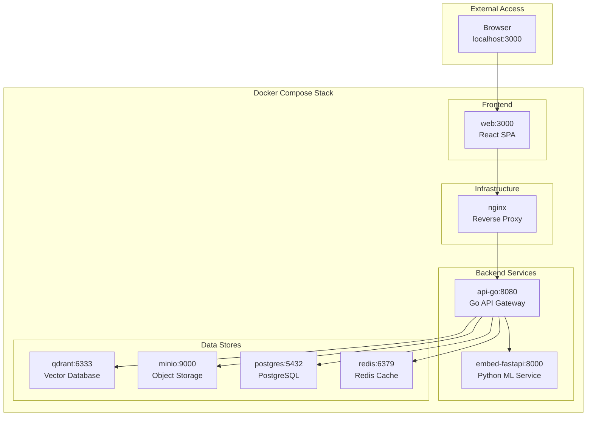
```mermaid
graph TB
    subgraph "Docker Compose Stack"
        subgraph "Frontend"
            WEB[web:3000<br/>React SPA]
        end
        
        subgraph "Backend Services"
            API[api-go:8080<br/>Go API Gateway]
            EMBED[embed-fastapi:8000<br/>Python ML Service]
        end
        
        subgraph "Data Stores"
            QDRANT[qdrant:6333<br/>Vector Database]
            MINIO[minio:9000<br/>Object Storage]
            PG[postgres:5432<br/>PostgreSQL]
            REDIS[redis:6379<br/>Redis Cache]
        end
        
        subgraph "Infrastructure"
            NGINX[nginx<br/>Reverse Proxy]
        end
    end
    
    WEB --> NGINX
    NGINX --> API
    API --> EMBED
    API --> QDRANT
    API --> MINIO
    API --> PG
    API --> REDIS
    
    subgraph "External Access"
        BROWSER[Browser<br/>localhost:3000]
    end
    
    BROWSER --> WEB
```

### Network Architecture

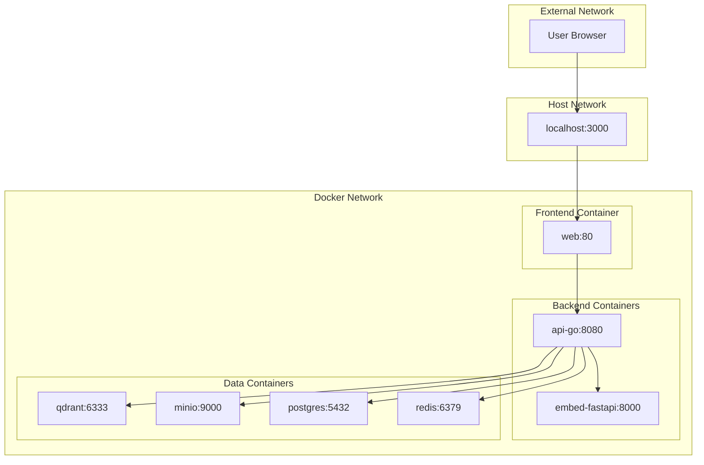
```mermaid
graph TB
    subgraph "External Network"
        USER[User Browser]
    end
    
    subgraph "Host Network"
        HOST[localhost:3000]
    end
    
    subgraph "Docker Network"
        subgraph "Frontend Container"
            WEB[web:80]
        end
        
        subgraph "Backend Containers"
            API[api-go:8080]
            EMBED[embed-fastapi:8000]
        end
        
        subgraph "Data Containers"
            QDRANT[qdrant:6333]
            MINIO[minio:9000]
            PG[postgres:5432]
            REDIS[redis:6379]
        end
    end
    
    USER --> HOST
    HOST --> WEB
    WEB --> API
    API --> EMBED
    API --> QDRANT
    API --> MINIO
    API --> PG
    API --> REDIS
```

## Security Architecture

### Authentication Flow

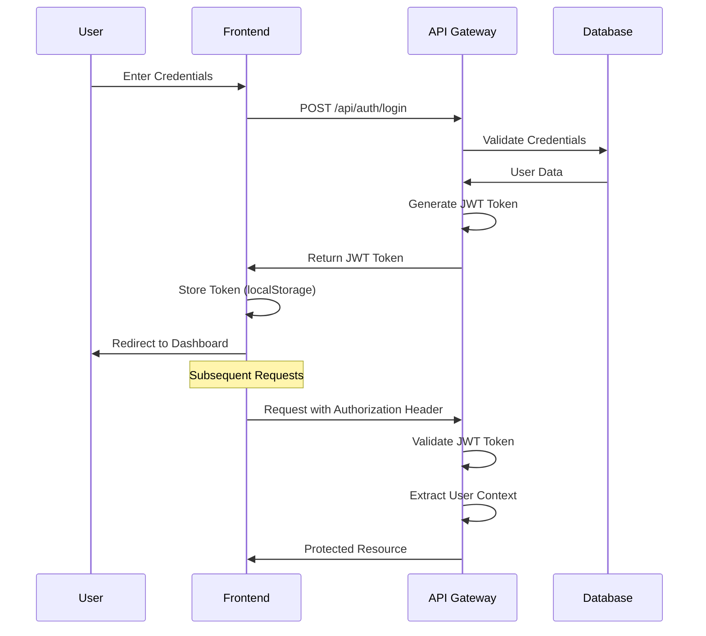
```mermaid
sequenceDiagram
    participant U as User
    participant F as Frontend
    participant A as API Gateway
    participant DB as Database

    U->>F: Enter Credentials
    F->>A: POST /api/auth/login
    A->>DB: Validate Credentials
    DB->>A: User Data
    A->>A: Generate JWT Token
    A->>F: Return JWT Token
    F->>F: Store Token (localStorage)
    F->>U: Redirect to Dashboard
    
    Note over F: Subsequent Requests
    F->>A: Request with Authorization Header
    A->>A: Validate JWT Token
    A->>A: Extract User Context
    A->>F: Protected Resource
```

### Security Layers

```mermaid
graph TD
    subgraph "Security Layers"
        subgraph "Transport Layer"
            TLS[TLS 1.3<br/>Encryption in Transit]
        end
        
        subgraph "Application Layer"
            JWT[JWT Authentication<br/>Token-based Auth]
            CORS[CORS Policy<br/>Cross-Origin Control]
            VALIDATION[Input Validation<br/>Request Sanitization]
        end
        
        subgraph "Data Layer"
            ENCRYPTION[Encryption at Rest<br/>Data Protection]
            RBAC[Role-Based Access<br/>Permission Control]
            AUDIT[Audit Logging<br/>Activity Tracking]
        end
        
        subgraph "Infrastructure Layer"
            FIREWALL[Network Firewall<br/>Port Security]
            RATE_LIMIT[Rate Limiting<br/>DDoS Protection]
            MONITORING[Security Monitoring<br/>Threat Detection]
        end
    end
    
    TLS --> JWT
    JWT --> CORS
    CORS --> VALIDATION
    VALIDATION --> ENCRYPTION
    ENCRYPTION --> RBAC
    RBAC --> AUDIT
    AUDIT --> FIREWALL
    FIREWALL --> RATE_LIMIT
    RATE_LIMIT --> MONITORING
```

## Performance Architecture

### Caching Strategy

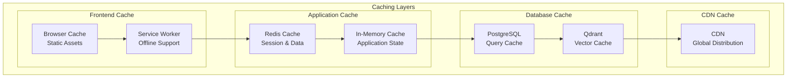
```mermaid
graph TD
    subgraph "Caching Layers"
        subgraph "Frontend Cache"
            BROWSER[Browser Cache<br/>Static Assets]
            SW[Service Worker<br/>Offline Support]
        end
        
        subgraph "Application Cache"
            REDIS[Redis Cache<br/>Session & Data]
            MEMORY[In-Memory Cache<br/>Application State]
        end
        
        subgraph "Database Cache"
            PG_CACHE[PostgreSQL<br/>Query Cache]
            QD_CACHE[Qdrant<br/>Vector Cache]
        end
        
        subgraph "CDN Cache"
            CDN[CDN<br/>Global Distribution]
        end
    end
    
    BROWSER --> SW
    SW --> REDIS
    REDIS --> MEMORY
    MEMORY --> PG_CACHE
    PG_CACHE --> QD_CACHE
    QD_CACHE --> CDN
```

### Load Balancing Strategy

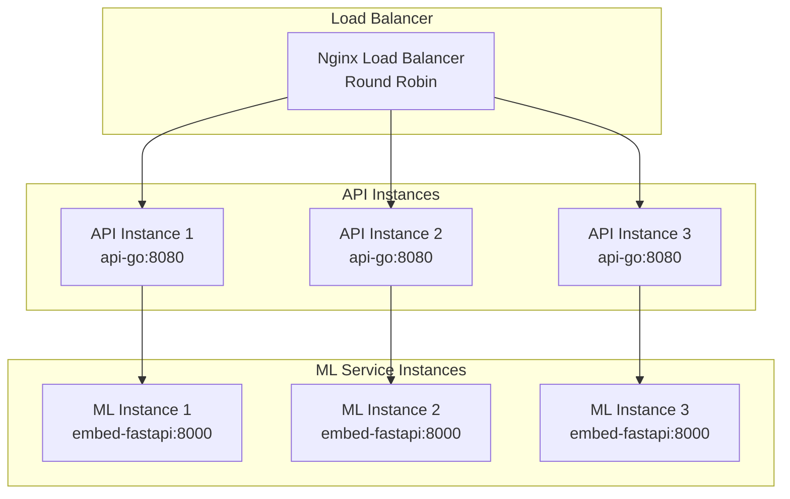
```mermaid
graph TD
    subgraph "Load Balancer"
        LB[Nginx Load Balancer<br/>Round Robin]
    end
    
    subgraph "API Instances"
        API1[API Instance 1<br/>api-go:8080]
        API2[API Instance 2<br/>api-go:8080]
        API3[API Instance 3<br/>api-go:8080]
    end
    
    subgraph "ML Service Instances"
        ML1[ML Instance 1<br/>embed-fastapi:8000]
        ML2[ML Instance 2<br/>embed-fastapi:8000]
        ML3[ML Instance 3<br/>embed-fastapi:8000]
    end
    
    LB --> API1
    LB --> API2
    LB --> API3
    
    API1 --> ML1
    API2 --> ML2
    API3 --> ML3
```

## Monitoring & Observability

### Metrics Collection

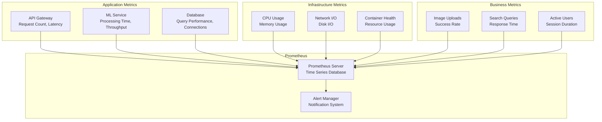
```mermaid
graph TD
    subgraph "Application Metrics"
        API_METRICS[API Gateway<br/>Request Count, Latency]
        ML_METRICS[ML Service<br/>Processing Time, Throughput]
        DB_METRICS[Database<br/>Query Performance, Connections]
    end
    
    subgraph "Infrastructure Metrics"
        CPU[CPU Usage<br/>Memory Usage]
        NETWORK[Network I/O<br/>Disk I/O]
        CONTAINER[Container Health<br/>Resource Usage]
    end
    
    subgraph "Business Metrics"
        UPLOADS[Image Uploads<br/>Success Rate]
        SEARCHES[Search Queries<br/>Response Time]
        USERS[Active Users<br/>Session Duration]
    end
    
    subgraph "Prometheus"
        PROM[Prometheus Server<br/>Time Series Database]
        ALERT[Alert Manager<br/>Notification System]
    end
    
    API_METRICS --> PROM
    ML_METRICS --> PROM
    DB_METRICS --> PROM
    CPU --> PROM
    NETWORK --> PROM
    CONTAINER --> PROM
    UPLOADS --> PROM
    SEARCHES --> PROM
    USERS --> PROM
    
    PROM --> ALERT
```

### Logging Architecture

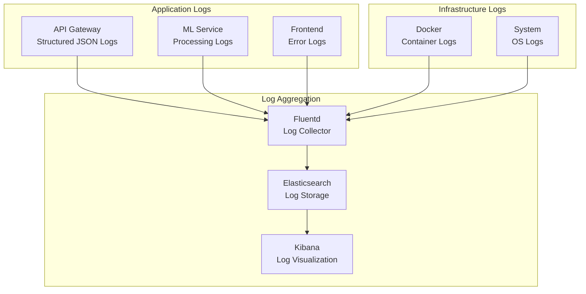
```mermaid
graph TD
    subgraph "Application Logs"
        API_LOGS[API Gateway<br/>Structured JSON Logs]
        ML_LOGS[ML Service<br/>Processing Logs]
        WEB_LOGS[Frontend<br/>Error Logs]
    end
    
    subgraph "Infrastructure Logs"
        DOCKER_LOGS[Docker<br/>Container Logs]
        SYSTEM_LOGS[System<br/>OS Logs]
    end
    
    subgraph "Log Aggregation"
        FLUENTD[Fluentd<br/>Log Collector]
        ELASTIC[Elasticsearch<br/>Log Storage]
        KIBANA[Kibana<br/>Log Visualization]
    end
    
    API_LOGS --> FLUENTD
    ML_LOGS --> FLUENTD
    WEB_LOGS --> FLUENTD
    DOCKER_LOGS --> FLUENTD
    SYSTEM_LOGS --> FLUENTD
    
    FLUENTD --> ELASTIC
    ELASTIC --> KIBANA
```

## Scalability Architecture

### Horizontal Scaling

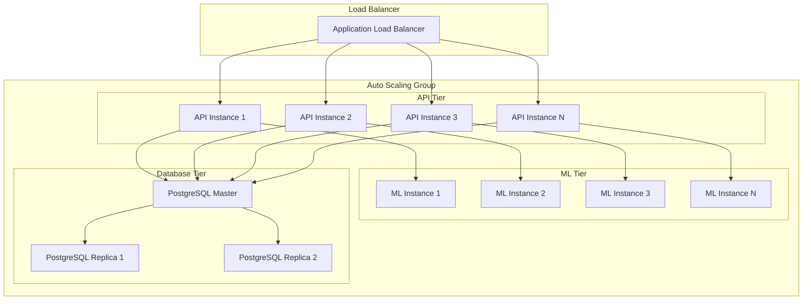
```mermaid
graph TD
    subgraph "Auto Scaling Group"
        subgraph "API Tier"
            API1[API Instance 1]
            API2[API Instance 2]
            API3[API Instance 3]
            API_N[API Instance N]
        end
        
        subgraph "ML Tier"
            ML1[ML Instance 1]
            ML2[ML Instance 2]
            ML3[ML Instance 3]
            ML_N[ML Instance N]
        end
        
        subgraph "Database Tier"
            PG_MASTER[PostgreSQL Master]
            PG_REPLICA1[PostgreSQL Replica 1]
            PG_REPLICA2[PostgreSQL Replica 2]
        end
    end
    
    subgraph "Load Balancer"
        LB[Application Load Balancer]
    end
    
    LB --> API1
    LB --> API2
    LB --> API3
    LB --> API_N
    
    API1 --> ML1
    API2 --> ML2
    API3 --> ML3
    API_N --> ML_N
    
    API1 --> PG_MASTER
    API2 --> PG_MASTER
    API3 --> PG_MASTER
    API_N --> PG_MASTER
    
    PG_MASTER --> PG_REPLICA1
    PG_MASTER --> PG_REPLICA2
```

### Microservices Communication

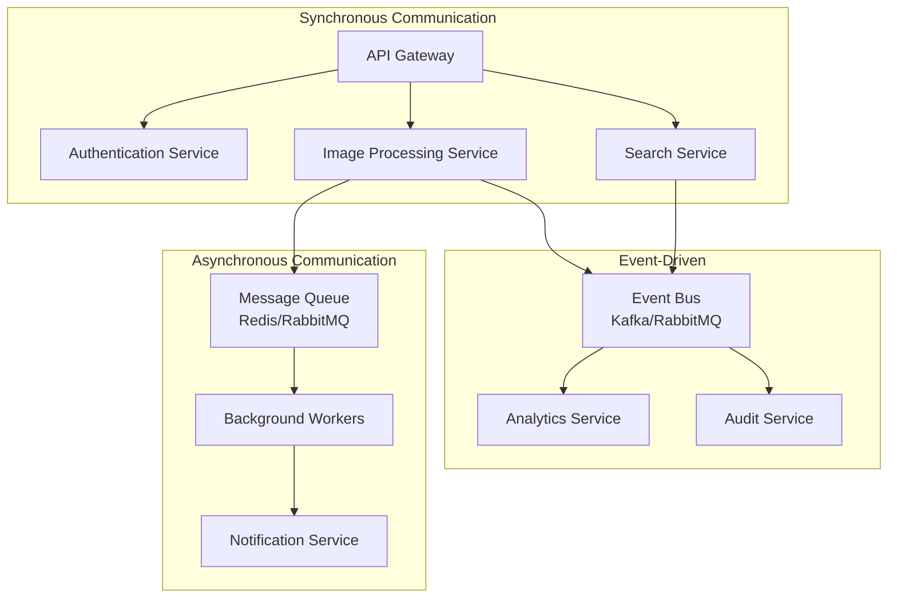
```mermaid
graph TD
    subgraph "Synchronous Communication"
        API_GW[API Gateway]
        AUTH_SVC[Authentication Service]
        IMAGE_SVC[Image Processing Service]
        SEARCH_SVC[Search Service]
    end
    
    subgraph "Asynchronous Communication"
        QUEUE[Message Queue<br/>Redis/RabbitMQ]
        WORKER[Background Workers]
        NOTIFICATION[Notification Service]
    end
    
    subgraph "Event-Driven"
        EVENT_BUS[Event Bus<br/>Kafka/RabbitMQ]
        ANALYTICS[Analytics Service]
        AUDIT[Audit Service]
    end
    
    API_GW --> AUTH_SVC
    API_GW --> IMAGE_SVC
    API_GW --> SEARCH_SVC
    
    IMAGE_SVC --> QUEUE
    QUEUE --> WORKER
    WORKER --> NOTIFICATION
    
    IMAGE_SVC --> EVENT_BUS
    SEARCH_SVC --> EVENT_BUS
    EVENT_BUS --> ANALYTICS
    EVENT_BUS --> AUDIT
```

## Disaster Recovery

### Backup Strategy

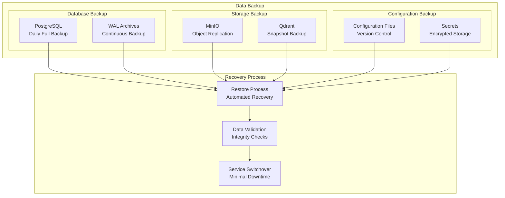
```mermaid
graph TD
    subgraph "Data Backup"
        subgraph "Database Backup"
            PG_BACKUP[PostgreSQL<br/>Daily Full Backup]
            PG_WAL[WAL Archives<br/>Continuous Backup]
        end
        
        subgraph "Storage Backup"
            MINIO_BACKUP[MinIO<br/>Object Replication]
            VECTOR_BACKUP[Qdrant<br/>Snapshot Backup]
        end
        
        subgraph "Configuration Backup"
            CONFIG_BACKUP[Configuration Files<br/>Version Control]
            SECRETS_BACKUP[Secrets<br/>Encrypted Storage]
        end
    end
    
    subgraph "Recovery Process"
        RESTORE[Restore Process<br/>Automated Recovery]
        VALIDATION[Data Validation<br/>Integrity Checks]
        SWITCHOVER[Service Switchover<br/>Minimal Downtime]
    end
    
    PG_BACKUP --> RESTORE
    PG_WAL --> RESTORE
    MINIO_BACKUP --> RESTORE
    VECTOR_BACKUP --> RESTORE
    CONFIG_BACKUP --> RESTORE
    SECRETS_BACKUP --> RESTORE
    
    RESTORE --> VALIDATION
    VALIDATION --> SWITCHOVER
```

This comprehensive set of architecture diagrams provides a complete visual representation of the Visual Anomaly Detection System, covering all aspects from high-level system overview to detailed component interactions, security, performance, and scalability considerations.
